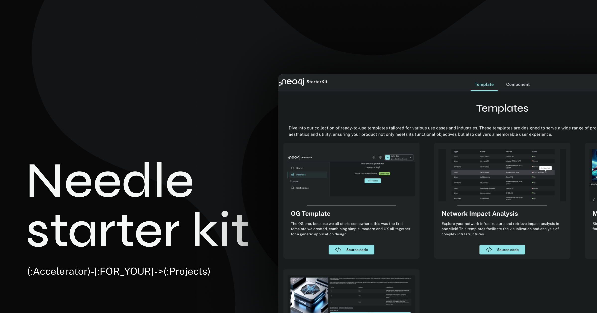

# Neo4j Needle StarterKit


Reactjs Responsive Starter Kit for building applications using [Neo4j Needle](https://www.neo4j.design/) for accelerating TTV.
You can access the [online version here](https://needle-starterkit.graphapp.io).

## Features
- 📈 Various templates and components focused on uses-cases and industries
- 🚀 Responsive: Adapts to different screen sizes for optimal user experience.
- 🌚 Dark/Light Mode Theme 🌞: Includes a theme wrapper to switch between light and dark modes without having to reinvent the wheel!
- ⚙️ Neo4j Integration: A simple example for connecting to a Neo4j database.
- 🔐 Neo4j Auto-connect: Automatically connects to the Neo4j database if the user has a session saved (using localStorage).
- 🛠️️ Modular approach: Facilitates easy customization.


## Installation:
```shell
yarn install
yarn run dev
```

## Documentation

The full documentation of every templates and components is available [here](https://neo4j.com/labs/neo4j-needle-starterkit/)

## What it looks like
### Desktop


